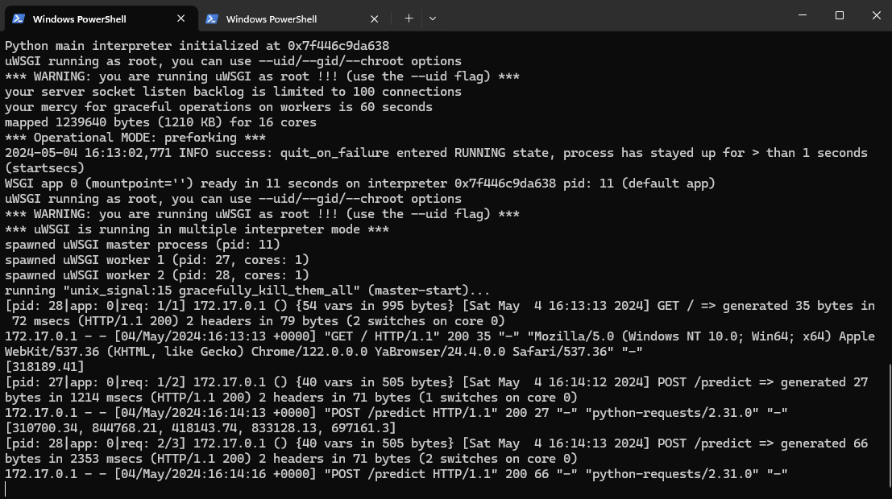
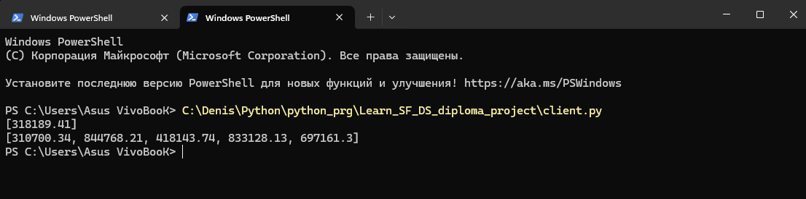

## Дипломный проект

### Учебный кейс  
### «Модель прогнозирования стоимости жилья для агентства недвижимости»

## Оглавление
1. [Постановка задачи](#Постановка-задачи)
2. [Описание данных](#Описание-данных)
3. [Основные этапы решения задачи](#Основные-этапы-решения-задачи)
4. [Результаты работы](#Результаты-работы)
5. [Выводы](#Выводы)


## Постановка задачи
Агентство недвижимости столкнулось с проблемой — риелторы тратят слишком много времени на сортировку объявлений и поиск выгодных предложений. Поэтому скорость их реакции и качество анализа не дотягивают до уровня конкурентов. Это сказывается на финансовых показателях агентства.

**Наша задача** — разработать модель машинного обучения, которая поможет обрабатывать объявления и увеличит число сделок и прибыль агентства. И внедрить ее небольшой веб-сервис, на вход которому поступают данные
о некоторой выставленной на продажу недвижимости, а сервис
прогнозирует его стоимость.


## Описание данных

Для работы был предоставлен [датасет](https://drive.google.com/file/d/11-ZNNIdcQ7TbT8Y0nsQ3Q0eiYQP__NIW/view) содержащий сведения о выставленной на продажу недвижимости.  
Дополнительно для очистки признаков испльзовался [датасет](https://www.kaggle.com/datasets/outwrest/simple-cities-us-dataset) города Соединенных Штатов.


## Основные этапы решения задачи

1. Проведен разведывательный анализ и очистка исходных данных и трансформация признаков;
2. Определены наиболее значимые факторы, влияющие на стоимость
недвижимости;
3. Построено несколько моделей для прогнозирования стоимости объектов недвижимости.
4. Проведена оценка результатов и выбор лучшей модели;
5. Для использования в продакшн, разработан веб-сервис, на вход которому поступают данные о выставленной на продажу недвижимости, а сервис прогнозирует его стоимость.

## Результаты работы

#### Исследовательская часть работы состоит из трех файлов в формате jupiter notebook:
- Очистка данных [1_clearing_the_data.ipynb](1_clearing_the_data.ipynb);
- Анализ и Baseline [2_baseline.ipynb](2_baseline.ipynb);
- Серия моделей и выбор лучшей [3_final_model.ipynb](3_final_model.ipynb).

Таблица с результатами.

<table border="1" class="dataframe">
  <thead>
    <tr style="text-align: right;">
      <th>Наименование модели</th>
      <th>R2 на тренировочных данных</th>
      <th>R2 на тестовых данных</th>
      <th>MAPE на тренировочных данных</th>
      <th>MAPE на тестовых данных</th>
    </tr>
  </thead>
  <tbody>
    <tr>
      <td>CatBoost</td>
      <td>0.895147</td>
      <td>0.811104</td>
      <td>3.527100</td>
      <td>5.477798</td>
    </tr>
    <tr>
      <td>RFR</td>
      <td>0.853940</td>
      <td>0.755725</td>
      <td>6.419202</td>
      <td>4.976279</td>
    </tr>
    <tr>
      <td>DTR</td>
      <td>0.789753</td>
      <td>0.665397</td>
      <td>5.537036</td>
      <td>5.398128</td>
    </tr>
    <tr>
      <td>poly</td>
      <td>0.541223</td>
      <td>0.538970</td>
      <td>10.950347</td>
      <td>5.238644</td>
    </tr>
    <tr>
      <td>base</td>
      <td>0.369000</td>
      <td>0.370000</td>
      <td>10.893000</td>
      <td>4.460000</td>
    </tr>
  </tbody>
</table>

В качестве лучшей выбрана модель [CatBoostRegressor](https://catboost.ai/en/docs/concepts/python-reference_catboostregressor).

#### Вывод модели в продакшн состоит:
- Код сервера состоит из двух файлов:
    - Собственно сам сервер [server.py](app\server.py);
    - Загрузка необходимых компонентов [loading_components.py](app\loading_components.py);
    - Сами компоненты находятся в папке [app\files](app\files);
- Файлов необходимых для воспроизводимости кода:
    - [requirements.txt](requirements.txt);
    - [uwsgi.ini](uwsgi.ini);
    - [Dockerfile](Dockerfile)
- Файла с клиентом для проверки работоспособности сервера [client.py](client.py).

Сервер собран в Docker контейнер и размещен на hub.docker.com [ссылка](https://hub.docker.com/r/kochden/server_image).

Содержимое Dockerfile:   
```
# Задаём базовый образ
FROM tiangolo/uwsgi-nginx-flask:python3.11
# Копируем содержимое папки ./app в рабочую директорию контейнера
COPY ./app ./
# Копируем файл requirements.txt в рабочую директорию контейнера
COPY ./requirements.txt ./
# Копируем файл uwsgi.ini в рабочую директорию контейнера
COPY ./uwsgi.ini ./
# Запускаем установку необходимых зависимостей
RUN pip install --no-cache-dir -r requirements.txt
```

Сборка контейнера производится командой ```docker build -t kochden/server_image .```

Запуск контейнера командой ```docker run -it --rm --name=server_container -p=80:80 kochden/server_image```

Клиент для проверки работы сервера проводит отбор двух наборов случайных строк из датасета в количестве 1 и 5 строк, отправляет их серверу для получения предсказания и выводит результат.  
Скриншоты работы сервера и клиента:  





## Выводы

Мы провели разведывательный анализ и очистку исходных данных. Нашли закономерности и выделили наиболее значимые факторы, влияющие на стоимость недвижимости. Построили несколько моделей для прогнозирования стоимости недвижимости, провели их оценку и выбрали модель показавшую лучшую оценку. Разработали веб-сервис, на вход которого поступают данные о некоторой выставленной на продажу недвижимости, а сервис прогнозирует его стоимость. Для простоты развертывания поместили код сервера в Docker контейнер и разместили его на hub.docker.com.